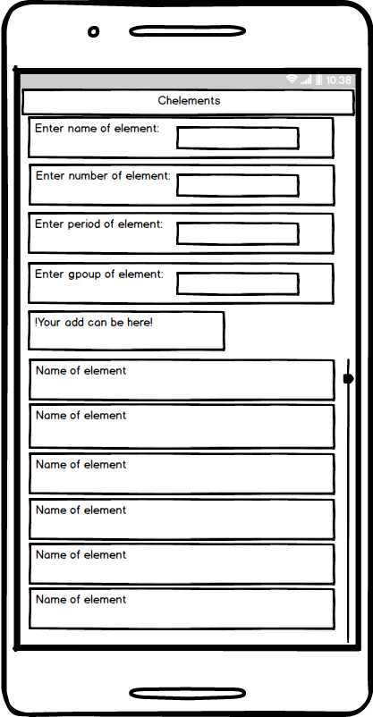
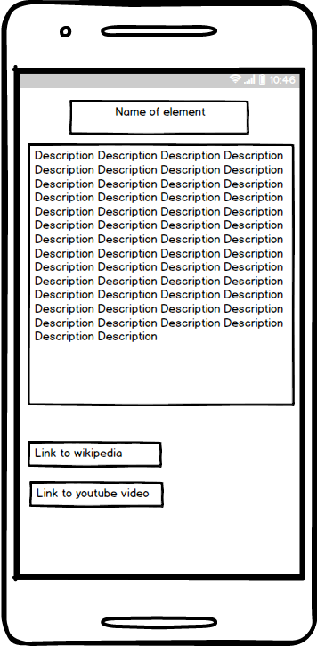

# Требования к проекту

## Содержание
 
1 [Введение](#intro)  
2 [Требования пользователя](#user_requirements)  
2.1 [Программные интерфесы](#program_interfaces)  
2.2 [Интерфейс пользователя](#user_interface)  
2.3 [Характеристика пользователей](#charact_users)  
2.3.1 [Аудитория приложения](#audit_app)  
3 [Системные требования](#system_requirements)  
3.1 [Функциональные требования](#functional_requirements)  
3.2 [Нефункциональные требования](#nofunctional_requirements)  
3.2.1 [Атрибуты качества](#attr_quality)  
3.2.1.1 [Требования к удобству использования](#requir_convenience_usages)  
3.2.2 [Ограничения](#restrictions)  
4 [Аналоги](#analogs)

<a name="intro"/>

## 1 Введение 
В проекте "Chelements" будет реализован справочник химических элементов. В данном интернет-приложении пользователь сможет получить всю необходимую информацию о химических элементах без подключения к сети Интернет. При подключении к сети Интернет можно будет использовать ссылки на дополнительную информацию о химических эелементах в сети.

<a name="user_requirements"/>

## 2  Требования пользователя

<a name="program_interfaces"/>

### 2.1  Требования пользователя
Проект будет написан на языке Java. Пользовательский интерфейс будет реализован на JavaFX.

<a name="user_interface"/>

### 2.2 Интерфейс пользователя   
* Главная страница

* Страница определённого меню
 
<a name="charact_users"/>

### 2.3 Характеристика пользователей

<a name="audit_app"/>

#### 2.3.1 Аудитория приложения
Студенты и школьники, которые изучают дисциплины,связанные с химией. 

<a name="system_requirements"/>

## 3 Систенмые требования

<a name="functional_requirements"/>

### 3.1 Функциональные требования
Пользователю предоставлены возможности:

| Функция | Требования | 
|:---|:---|
| Поиск элементов  | Поиск может производится как по названию элемента, так и по номеру элемента. Должны выводится все совпадения по элементам |
| Просмотр детальной информации о элементах| Должна выводится информация о элементе. |

<a name="nofunctional_requirements"/>

### 3.2 Нефункциональные требования

<a name="attr_quality"/>

#### 3.2.1 Аттрибуты качества
Важными атрибутами являются высокая производительность, малое потребление ресурсов.

<a name="requir_convenience_usages"/>

##### 3.2.1.1 Требования к удобству использования
* Должен быть реализован понятный и удобный пользователю интерфейс.
* При большом количестве товаров должна быть сделана пагинация для удобного просмотра.

<a name="restrictions"/>

#### 3.2.2 Ограничения
* Приложение реализовано на языке Java.

## 4 Аналоги
Аналогами проекта являются:  Известные аналоги: [Справочник химических элементов]https://play.google.com/store/apps/details?id=com.apssinfo.spravochnikkhimicheskieelementy&hl=eu) и [Химия](https://play.google.com/store/apps/details?id=com.studyapps.chemru&hl=ru
).  

 Возможности |Справочник химических элементов| Химия
--- | :-: | :-: 
Доступно на Android |Да|Да
Поддержка русского языка | Нет|Да
Бесплатно |Да|Да
Поиск элементов | Нет|Да

